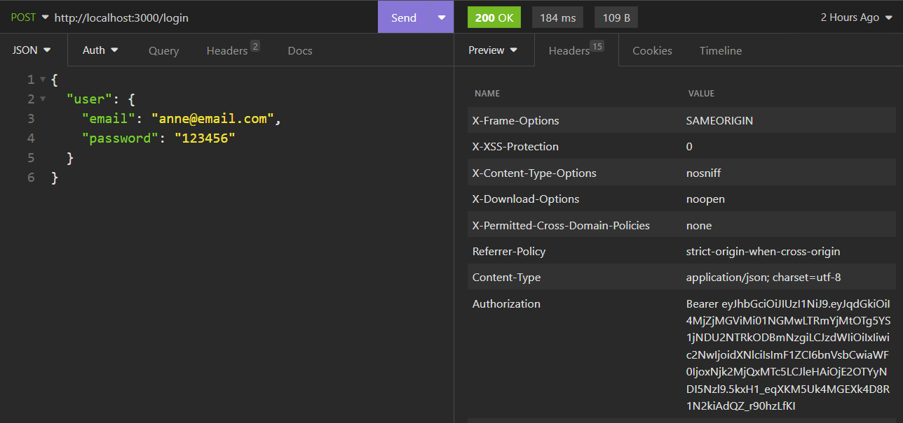

# Book Library API

<!-- TABLE OF CONTENTS -->
<details open="open">
  <summary>TABLE OF CONTENTS</summary>
  <ol>
    <li>
      <a href="#about-the-project">About the Project</a>
      <ul>
        <li><a href="#technologies">Technologies</a></li>
      </ul>
    </li>
    <ul>
        <li><a href="#business-rules">Business rules</a></li>
        <li><a href="#database-squema">Database Squema</a></li>
        <li><a href="#api-endpoints">API Endpoints</a></li>
    </ul>
    </li>
    <li>
      <a href="#instruções-gerais">General Instructions</a>
      <ul>
        <li><a href="#instalação">Installation</a></li>
      </ul>
    </li>
    </li>
    <li><a href="#usage-examples">Usage Examples</a></li>
      <ul><li><a href="#testing-with-insomnia">Testing with Insomnia</a></li></ul>
    </li>
    </li>
  </ol>
</details>

<!-- ABOUT THE PROJECT -->

## :notebook_with_decorative_cover: About the project

This is an API Rest developed using TDD in Ruby on Rails that allows team members to add books to a shared list and also query books based on specific parameters.

For this application it was used JWT (JSON Web Token) approach for authentication management.
Devise and Devise-JWT were used to manage authentication and authorization.

### 🛠️ Technologies

<ul>
  <li>Ruby 3.1.2</li>
  <li>Rails 7.0.8</li>
  <li>PostgreSQL</li>
  <li>Insomnia / Postman</li>
  <li>Devise JWT</li>
  <li>Rspec</li>
</ul>

### 📑Business rules

- All Users can see the books list (unauthenticated);
- All Users can search for a book based on title, genre, author or publication_year (unauthenticated);
- All Users can search for authors and/or genres (unauthenticated);
  <br>
- All logged Users can update a Author and/or Genre (authenticated);
- All logged Users can delete a Author and/or IF no books are associated with it (authenticated);
- All logged Users can add a new book IF there is no book with the same title (authenticated);
- All logged Users can update a book (authenticated);
- All logged Users delete books (authenticated);

### :card_file_box: Database Squema

<div align="center">
  
</div>

### :truck: Endpoints

- User Endpoints

| URL / ENDPOINT | VERB   | DESCRIPTION    |
| -------------- | ------ | -------------- |
| /signup        | POST   | Create user    |
| /login         | POST   | Generate token |
| /logout        | DELETE | Destroy user   |

- Book Enpoints

| URL / ENDPOINT       | VERB   | DESCRIPTION                     |
| -------------------- | ------ | ------------------------------- |
| /api/v1/books        | GET    | Return all books                |
| /api/v1/books/:id    | GET    | Return a book                   |
| /api/v1/books/search | POST   | Return a book by any attributes |
| /api/v1/books        | POST   | Create a book                   |
| /api/v1/books/:id    | PATCH  | Updates a book                  |
| /api/v1/books/:id    | DELETE | Destroy a book                  |

- Genre Enpoints

| URL / ENDPOINT     | VERB   | DESCRIPTION       |
| ------------------ | ------ | ----------------- |
| /api/v1/genres     | GET    | Return all genres |
| /api/v1/genres/:id | GET    | Return one genre  |
| /api/v1/genres     | POST   | Create a genre    |
| /api/v1/genres/:id | PATCH  | Updates a genre   |
| /api/v1/genres/:id | DELETE | Destroy a genre   |

- Author Enpoints

| URL / ENDPOINT      | VERB   | DESCRIPTION        |
| ------------------- | ------ | ------------------ |
| /api/v1/authors     | GET    | Return all authors |
| /api/v1/authors/:id | GET    | Return a author    |
| /api/v1/authors     | POST   | Create a author    |
| /api/v1/authors/:id | PATCH  | Updates a author   |
| /api/v1/authors/:id | DELETE | Destroy a author   |

<!-- GETTING STARTED -->

## :book: General instructions

Below are the instructions for the installation, configuration, and use of the project's API.

### :electric_plug: Installation

1. Clone the repo

```sh
   git clone https://github.com/ANNEBORTOLI/book-library-api
```

2. Installing Packages(gems)

```sh
    bundle install
```

3 - Generate the devise-jwt secret

- In the terminal type:

```sh
    bundle exec rake secret
```

- Add it to the encrypted credentials:

```sh
# VsCode
EDITOR='code --wait' rails credentials:edit
```

- Add a new key: value in the encrypted.yml file

```sh
# Change the name for 'devise_jwt_secret_key'
# Used as the base secret for Devise-JWT
devise_jwt_secret_key: (copy and paste the generated secret here)
```

4. Create a db, run migrations and run seed

```sh
    rails db:create db:migrate db:seed
```

4. Run tests

```sh
    bundle exec rspec
```

5. Run API locally

```sh
    rails s
```

6. Test the endpoints with Insomnia / Postman

- Use the login provided by the seeds file or sign up with a new one to test authenticated routes.

```sh
    user: test@email.com | password: 123456
```

- To create a new book use the JSON example below.

```sh
    {
      "title": "Your new Title",
      "publication_year": 2023,
      "author_id": 1,
      "genre_id": 2
    }
```

- To update a book you only need to provide the attributes you want to change.

## :book: Usage Examples

### :camera_flash: Testing with Insomnia

- Creating User:
<div align="center">
  
</div>
<br>

- Logging In:
<div align="center">
  
</div>
<br>

- Check the authorization token:
<div align="center">
  
</div>
<br>

- Provide the token in order to update a book:
 <div align="center">
  
</div>
<br>
